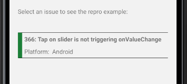

<h2 align="center"> Slider Repro App </h2>
<p align="center">
    The following application allows to test and reproduce issues reported on the <a href="https://github.com/callstack/react-native-slider">@react-native-community/slider</a> library.
</p>
<p align="center">
    <a href="https://github.com/BartoszKlonowski/rn-slider-repro-app/blob/main/LICENSE">
        
    </a>
    <a href="https://github.com/BartoszKlonowski/rn-slider-repro-app/actions/workflows/rnSliderReproApp-CI.yml">
        
    </a>
</p>


I maintain the [@react-native-community/slider](https://github.com/callstack/react-native-slider) repository. And very often issues created for the `<Slider/>` require reproduction example and the stable playground to check the specific case.
<br/>Also it is needed to keep all the reproduction samples well organized and in decent order, so when I reproduce some problem I can always return to it.

Here's where the **RN Slider Repro App** comes in.

---

## Installation & Usage ##

This application can be installed by:
* cloning the repo and installing it on your device by following the [Running on device](https://reactnative.dev/docs/running-on-device) guides on the official React Native page
* downloading it directly from the [Releases page](https://github.com/BartoszKlonowski/rn-slider-repro-app/releases) and installing it

After successful installation you should see the main screen with all the issues that were already added.
<br/>If there's no issue that you are interested in or which you would like to check, please contribute by [adding it to the application](#How-to-add-new-example).


---


## Contributing ##

If you would like to contribute to the *RN Slider Repro App* you are more then welcome!
<br/>You can do this in one of the following ways:

* Create an [Issue](https://github.com/BartoszKlonowski/rn-slider-repro-app/issues/new) and request for an example that you are interested in
* Create the [Pull Request](https://github.com/BartoszKlonowski/rn-slider-repro-app/compare) with the desired changes.
<br/>Please remember to give the detailed description of why such change is needed, what is the test plan and what are the details of your implementation. This will make the review easier and quicker.
* [Adding your own example](#How-to-add-new-example)

---

## How to add new example? ##

Clone your fork of this repository and run `npm install` in the root of this repository to install all the dependencies and tools

<br/>Implement your example by creating new `Component` in the [ReproExamples directory](https://github.com/BartoszKlonowski/rn-slider-repro-app/tree/main/source/ReproExamples)
<br/>Please remember to name your component and new file with the format of
<br/>`Issue<number>`, where number is the number of issue reported on the @react-native-community/slider

Your component (of example issue 1234) can look like:
```javascript
import React from "react";
import { View, StyleSheet } from "react-native";

export function Issue1234() {
  return (
    <View style={styles.mainLayout}>
      <Slider
        value={0}
      />
    </View>
  );
}

const styles = StyleSheet.create({
  mainLayout: {
    flex: 1,
    alignItems: "stretch",
    justifyContent: "center",
  },
});
```

<br/>Next, add your component `Issue1234` to the `screens` array (in the [source/ReproExamples/Issues](https://github.com/BartoszKlonowski/rn-slider-repro-app/blob/main/source/ReproExamples/Issues.js) file)
like so:

```javascript
import { Issue1234 } from "./Issue1234";

const screens = [
    {name: "1234", component: Issue1234}
];
```

<br/>And that's it! Your example will appear on the list:



Note, that here's the real issue presented, as for non-existing issue, or incorrect number the widget will not appear!

<br/>If you are satisfied with the example of your issue, and you would like to share the exact usage scenario please do create a PR with your implementation!

---

## Thank you! ##

If you like this project, or you find it helpful, please share your opinion with the author or just give it a star!
